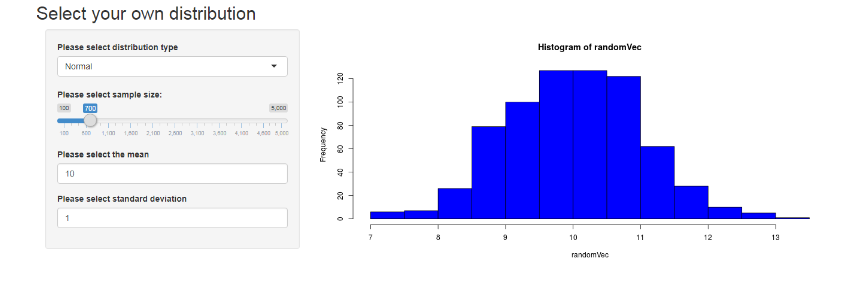

## Introduction

- This course project constists on two different taks:

        1. Part 1:
                - Write a shiny application with associated supporting documentation.
                - The documentation should be thought of as whatever a user will need to get 
                started using your application.
                - Deploy the application on Rstudio's shiny server
                - Share the application link by pasting it into the provided text box Share your 
                server.R and ui.R code on github
        2. Part 2: 
                - 5 slides to pitch our idea done in Slidify or Rstudio Presenter
                - Your presentation pushed to github or Rpubs
                - A link to your github or Rpubs presentation pasted into the provided text box

--- .class #id 

## My application

The main idea is that the user can simulate random samples of data following either a normal or exponential pattern being able to choose the sample size as well as other distribution specific parameters:

        - Normal:
                1. Mean
                2. STD (Standard Deviation)
        - Exponential: 
                1. Lambda
This is the r code used for each one:

```r
if(distType == "Normal") {
        randomVec <- rnorm(size,mean = as.numeric(input$mean),sd =as.numeric(input$sd))
        }
else {
        randomVec <- rexp(size, rate = 1/as.numeric(input$lambda))
}
```

```
## Error: <text>:4:1: unexpected 'else'
## 3:         }
## 4: else
##    ^
```


--- .class #id 

## Screenshot normal distribution
The app can be accessed under the following link:
https://jotav93.shinyapps.io/CourseProject/
Instructions:
        
        - Select the type of distribution you want
        - Input the values you require and the distribution will automatically update.

```r
#some code that gets run. It actually plots the image
grid.raster(img)
```



--- .class #id 
## Screenshot exponential distribution
This is how the exponential distribution looks like. 
Instructions:

        - Select the type of distribution you want
        - Input the values you require and the distribution will automatically update.

```r
#some code that gets run. It actually plots the image
grid.raster(img)
```


